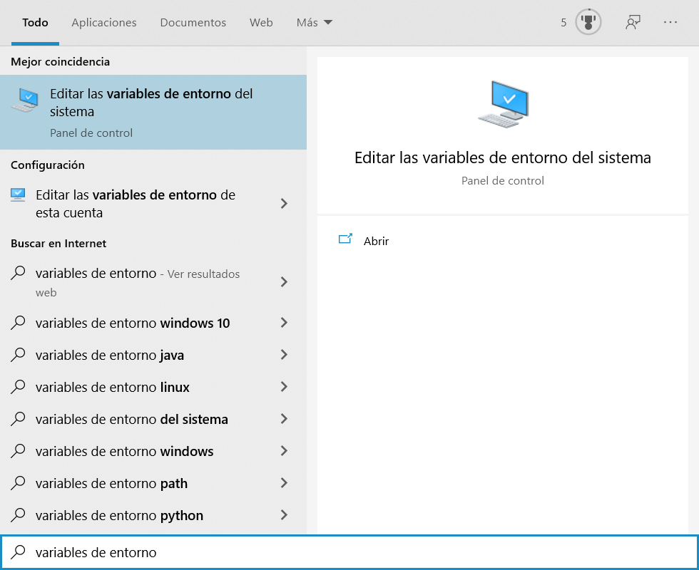
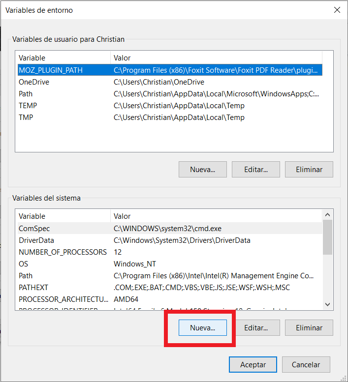
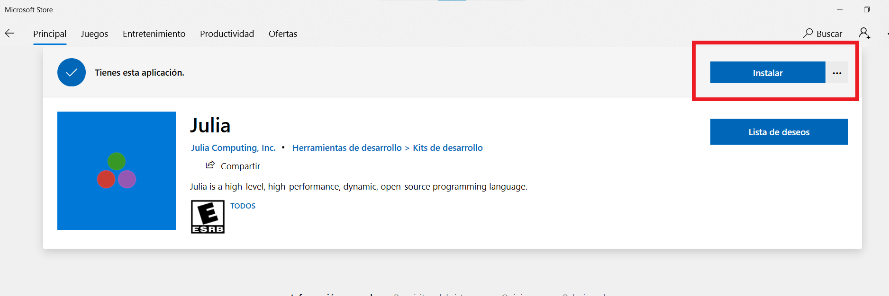
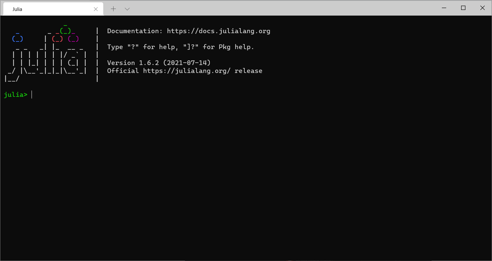
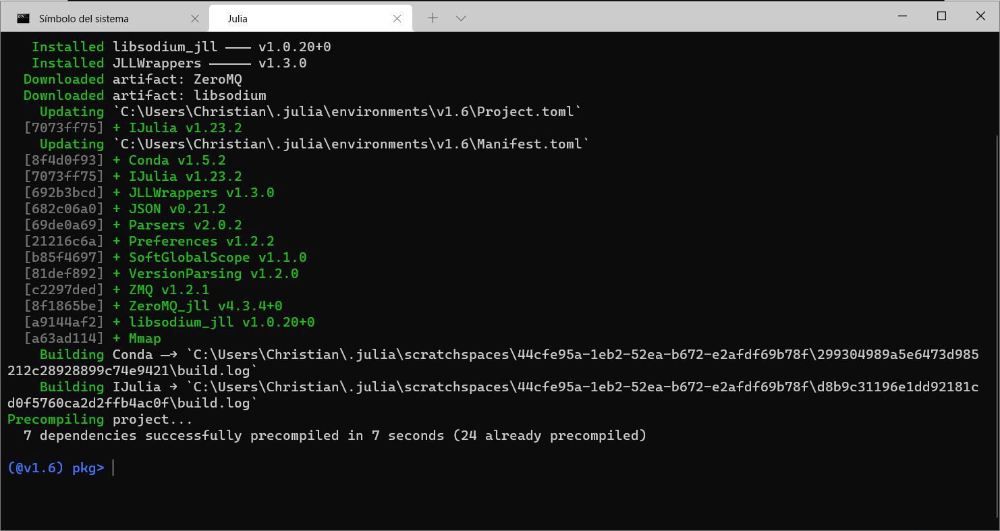
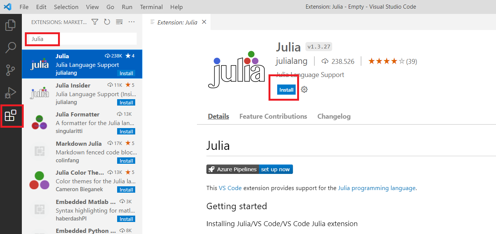
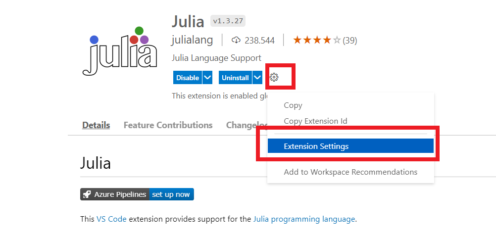

# Instalación

[Regresar](./README.md)

---

Aquí tenemos las instrucciones para instalar en nuestra máquina:

- [Julia](https://julialang.org/)
- [Pluto](https://github.com/fonsp/Pluto.jl) y [IJulia](https://julialang.github.io/IJulia.jl/stable/), los paquetes necesarios para trabajar con _notebooks_
- [Visual Studio Code](https://code.visualstudio.com/), un IDE completo perfecto para Julia

Como prerrequisitos para la instalación debes contar con suficiente espacio en el disco duro en el que quieres instalar Julia (para el taller, al menos unos 10 GiB).

El instalador en sí solo ocupa unos 80 MiB de espacio, pero el instalar paquetes adicionales, además de las compilaciones de los mismos, fácilmente nos lleva al orden de los 10 GiB.

## Cambiando la ubicación de instalación de paquetes de Julia (opcional)

La manera de indicarle a Julia que instale los paquetes en una ubicación de nuestra elección (por ejemplo, un segundo disco duro con mayor espacio) es crear una variable de entorno `JULIA_DEPOT_PATH` y asignarle la ruta en la que deseemos instalar los paquetes.

Como ya se mencionó, esto es independiente del lugar en donde se instala Julia y por eso hay que hacerlo **antes de la instalación**.

- Ejemplo: `JULIA_DEPOT_PATH=D:\.julia`

Una forma de hacer esto en Windows 10 es escribir `Variables de entorno` en el menú de inicio y seleccionar `Editar las variables de entorno del sistema`.



Luego, hacer clic en el botón `Variables de entorno...` en la parte inferior derecha.


En la parte inferior (variables del sistema), hacer clic en el botón `Nueva...`.



Crear una variable que se llame `JULIA_DEPOT_PATH` y seleccionar la carpeta en la que deseemos que se instalen TODOS los paquetes adicionales de Julia. Por ejemplo, en otro disco duro con mayor capacidad.


## Julia

Las instrucciones para instalar Julia para cada sistema operativo están en inglés en la [página de descargas](https://julialang.org/downloads/).

Vamos a dar más detalle para instalar en Windows porque hay ciertos detalles que cuidar. Para el caso de Linux/Mac, lo más probable es que estés más familiarizado con el uso de la terminal y no tengas problema siguiendo las instrucciones de la documentación.

En Windows (10, al menos), hay dos formas para instalar Julia:

1. La más nueva y rápida (y versátil) desde la [Microsoft Store](https://www.youtube.com/watch?v=rFlbjWC6zYA) (sigue el enlace para ver la presentación en Juliacon 2021)

2. La descarga e instalación manual 

### 1. Desde la Microsoft Store

Esta forma se encarga de instalar un multiplexor de Julia, llamado [Juliaup](https://github.com/JuliaLang/juliaup), que permite actualizar Julia e incluso instalar distintas versiones en la misma computadora y cambiar entre ellas de forma sencilla.

1. Abre la Microsoft Store.

2. Escribe `Julia` en la barra de búsqueda y selecciona la aplicación.
	
	

2. Haz clic en el botón `Instalar`.

	

3. ¡Listo! Ahora puedes abrir la consola de Julia como cualquier otra aplicación desde el menú de inicio, escribir `julia` en una consola de símbolo del sistema y, adicionalmente, si tienes instalada la consola de Windows (recomendada y disponible en la Microsoft Store también), también aparecerá ahí.

	


### 2. Instalación manual

De esta forma, tendrás que manualmente instalar nuevas versiones de Julia conforme sean liberadas.

1. Descargar el ejecutable del **instalador** de Julia desde la [página de descargas](https://julialang.org/downloads/).

2. Instalar **como administrador** (dar clic derecho en el instalador y seleccionar "Ejecutar como Administrador") en la ubicación deseada.
	
	- Ejemplo:  en `D:\Programas\Julia`

	**N.B.** Asegúrate de tener derechos de escritura en los directorios donde  se instala Julia. Para modificar los permisos, haz clic derecho en la carpeta designada para `JULIA_DEPOT_PATH` (por ejemplo, `D:\.julia`) luego en "Propiedades", luego en la pestaña "Seguridad":
	
	
	
	Dentro de esa pestaña, seleccionar "Usuarios" y en la sección inferior seleccionar el cuadro de `Control total` y dar "Aceptar".
	
	

3.  ¡Listo! Ahora puedes abrir la consola de Julia como cualquier otra aplicación desde el menú de inicio, escribir `julia` en una consola de símbolo del sistema y, adicionalmente, si tienes instalada la consola de Windows (recomendada y disponible en la Microsoft Store también), también aparecerá ahí.

	

## Pluto y IJulia

Una vez instalado Julia en nuestra computadora, podemos abrirlo como cualquier otro programa instalado en Windows desde el menú de inicio; desde la Windows Terminal, o desde la línea de comandos escribiendo `julia`. La recomendación es usar la Windows Terminal por su soporte a Unicode.



Esta consola se llama `REPL` (_Read-Evaluate-Print-Loop_ &mdash;Ciclo de lectura, evaluación e impresión&mdash; en español) y nos permite usar Julia de forma interactiva, acceder a la ayuda y al gestor de paquetes.

Con el gestor de paquetes, Julia nos permite instalar paquetes adicionales a la biblioteca base. Al momento de escribir esto, hay más de 4000 paquetes en el [registro general](https://github.com/JuliaRegistries/General).

Estos paquetes registrados están hospedados en [GitHub](https://github.com/). Vamos a instalar dos de estos paquetes:

1. Pluto
2. IJulia

Para poder instalar paquetes, debemos acceder al gestor de paquetes intregado a Julia tecleando `]`

```julia
julia> ]
(@1.6) pkg> 
```
Nota que el _prompt_ cambió a `(@1.6) pkg>`. El símbolo `@1.6` nos indica el **ambiente** en el que estamos instalando los paquetes. En este caso es el base o principal.

### Pluto

Tal vez estés familiarizado con el ambiente de _notebooks_ de Jupyter. Aunque parezca increíble debido a su popularidad, [no a todos les gustan](https://youtu.be/7jiPeIFXb6U).

Pluto es un enfoque diferente a trabajar con _notebooks_ ya que, aunque también se trabaje en el _browser_, es fundamentalmente distinto. Ya lo veremos en el primer [_notebook_](../notebooks/00.Introducción-a-Pluto.jl.html) del taller.

Por ahora, solo lo instalaremos escribiendo

```julia
(@1.6) pkg> add Pluto
```
en el gestor de paquetes. Al terminar, deberás tener una pantalla como la siguiente.


### IJulia

IJulia es el _kernel_ de Julia para Jupyter. Aunque no usaremos _notebooks_ de Jupyter en este taller, hay muchos materiales disponibles en Internet en este formato. Por lo tanto, lo instalaremos para que Julia esté visible desde tu instalación propia de Jupyter y puedas abrir _notebooks_ de Jupyter desde Jupyter Lab, por ejemplo.

La nueva versión de la extensión de Jupyter para VS Code, permite ver y **correr** _notebooks_ de Jupyter desde VS Code **sin instalar IJulia**. Lo instalamos para los que acostumbren usar Jupyter.

En el gestor de paquetes, escribe

```julia
(@1.6) pkg> add IJulia
```
Al terminar, deberás tener una pantalla como la siguiente:



Para salir del gestor de paquetes solo usa la tecla `retroceso` de tu teclado. Nota que el _prompt_ cambia a `julia> ` de nuevo.

## Visual Studio Code

El ambiente de desarrollo integrado (IDE, en inglés) que usaremos es Visual Studio Code de Microsoft. Este es un IDE muy bueno para muchos lenguajes de programación: es muy rápido, ligero, con control de versiones integrado e incluso una terminal.

De forma oficial, un equipo de desarrolladores ha estado trabajando en la integración de [Julia en VS Code](https://www.julia-vscode.org/). Esta es la razón por la que lo usaremos.

Además de lo anterior, VS Code nos permite visualizar ahora de forma nativa Jupyter Notebooks y con la extensión de Julia, podemos ejecutarlos también sin instalar nada adicionalmente.

Vamos a instalar VS Code:

1. Descarga VS Code desde [https://code.visualstudio.com/](https://code.visualstudio.com/)

	

2. Instálalo como cualquier otro programa, pero al llegar a la siguiente pantalla, selecciona:

	- [X] Agregar la acción "Abrir con Code" al menú contextual de archivo del Explorador de Windows
	- [X] Agregar la acción "Abrir con Code" al menú contextual de directorio del Explorador de Windows
	- [X] Agregar a PATH

	

3. Abre VS Code.

4. Ve a las configuraciones de VS Code (engrane -> *Settings* o el íconos de cubos).

5. Busca la extensión de Julia y haz clic en `Install`.

	

6. Haz clic en la configuración de la extensión dando clic en el engrane.
	
	

7. Activa la configuración palomenando el cuadro junto a `Julia: Notebook Controller`.

	

## Conclusión

Listo, ya tenemos instalado Julia, los paquetes que nos permiten ver _notebooks_ tanto de Pluto como de Jupyter y un poderoso IDE.

De hecho, ahora intenta descargar algún _Jupyter notebook_ de Julia y visualízalo y ejecútalo desde VS Code.

---

[Regresar](./README.md)
