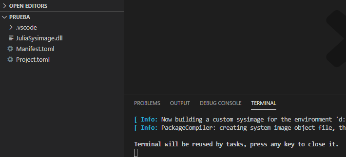

# Precompilado de paquetes

[Regresar](./README.md)

---

Hemos visto que, cuando un ambiente independiente no cuenta con un módulo o paquete, el gestor de paquetes se encarga de descargar la versión especificada en los archivos TOML.

Cuando el ambiente está vacío y agregamos un módulo o paquete, el gestor de paquetes descarga la versión más reciente y lo agrega a los archivos TOML. Si en la máquina en la que trabajamos, el paquete ya había sido previamente descargado (para otro ambiente, por ejemplo), Julia no lo vuelve a descargar, pero sí lleva tiempo cargarlo (usando `using` o `import`).

Además, cada vez que abrimos una nueva sesión de Julia, la primera vez que mandamos a llamar a una función, Julia la vuelve a compilar. Esto puede llevar algo de tiempo (por ejemplo, solía llevar tiempo cargar el paquete `Plots`). 

Podemos tomar el tiempo de carga de un paquete en una sesión de Julia nueva con la macro `@time`.

1. En un directorio vacío llamado `Precompilado`, iniciamos el gestor de paquetes.

2. Activamos el ambiente y agregamos el paquete `Plots`.

	

3. Después, podemos cargar el módulo en el REPL tomándole el tiempo con la macro `@time`:

	

	Vemos que le lleva más de 3 segundos a Julia cargar `Plots` en este ambiente. Además, necesita más de 7 millones de *allocations* de memoria y más de 500 megabytes. Si lo hacemos nuevamente, el tiempo y los recursos de memoria son solo una fracción.

**NOTA:** Una queja común sobre Julia era el tiempo hasta poder tener una primera gráfica (TTFP, por las siglas en inglés para _time to first plot_). Sin embargo, en la última versión, los desarrolladores han puesto mucho énfasis en el precompilado de paquetes. Tres segundos ahora son bastante aceptables. En la primera versión de este taller eran casi 20 segundos.

## PackageCompiler.jl

El paquete [PackageCompiler.jl](https://julialang.github.io/PackageCompiler.jl/dev) nos permite tener una imagen del sistema de esta compilación para un ambiente dado. De esta forma, se puede pasar la indicación al momento de arrancar un REPL de Julia que precargue esta imagen y los tiempos de carga de los paquetes de nuestro ambiente se reducirán drásticamente.

Puedes ver la documentación del paquete (al momento de escribir esto aún está en estapa de desarrollo) y puede ser un poco complicado el proceso. Cabe señalar, que en caso de que algún paquete del ambiente se actualice o se instale después de la creación de la imagen, **es necesario volver a crear la imagen**.

Además de lo anterior, este paquete permite generar archivos binarios de alguna aplicación de Julia para ejecutarla sin necesitar abrir una sesión de Julia.

## La forma fácil en VS Code

El *plug-in* de Julia para Visual Studio Code cuenta con una funcionalidad experimental (al momento de escribir esto) para generar la imagen del sistema para un ambiente dado.

**NOTA:** Asegúrate de seleccionar el ambiente en la barra de estado inferior de VS Code

1. En la paleta de comandos de VS Code (`ctrl` + `shift` + `p`), seleccionamos `Tasks:Run Build Task`.

	
	
1. Aparecerá en la parte superior la opción `julia: Build custom sysimage for current environment (experimental)`. Selecciona esta opción.

	
	
1. En la terminal aparecerá el mensaje que nos dice que se está construyendo la imagen y nos da el directorio del ambiente que está contruyendo y que este proceso puede demorar.

	
	
1. Al término del proceso, se habrá generado un archivo DLL en el directorio del ambiente y en la terminal habrá un mensaje que nos dice que presionemos cualquier tecla para cerrar esa terminal.
	
	

1. En la configuración de Julia (engrane -> *settings*), cerciórate que la siguiente opción esté seleccionada:
	
	
	
	Esta opción hace que VS Code busque un archivo de imagen del sistema (la DLL que acabamos de generar) y lo cargue al iniciar el REPL de Julia.

1. Ahora, podemos abrir una nueva sesión del REPL de Julia y automáticamente cargará la DLL.

1. Si tomamos el tiempo de carga de `Plots`, ¡ahora es casi instantáneo!

	
	
---

[Regresar](./README.md)